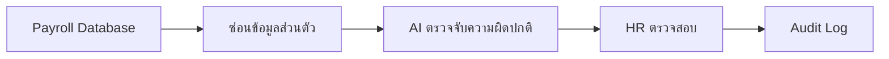

# ข้อ 7: AI Feature Design

## หัวข้อที่เลือก

**Payroll Anomaly Detector — ตรวจจับความผิดปกติของเงินเดือน**

## Architecture

## การทำงาน

1. นำข้อมูลเงินเดือน OT และโบนัสจาก Payroll Database
2. ลบข้อมูลส่วนตัวและเปลี่ยน Employee ID เป็น Token
3. AI เปรียบเทียบกับข้อมูลย้อนหลังและแจ้งรายการที่ผิดปกติ
4. HR ตรวจสอบ
5. บันทึกผลการตรวจสอบลง Audit Log

## Data Privacy

- ส่งให้ AI เฉพาะข้อมูลที่จำเป็น ไม่ส่งชื่อ ที่อยู่ หรือเลขบัตรประชาชน
- ใช้ Token แทน Employee ID และเก็บข้อมูลจับคู่ไว้ภายในบริษัท
- เข้ารหัสข้อมูลทั้งระหว่างส่งและขณะจัดเก็บ
- จำกัดสิทธิ์ให้เฉพาะ HR และ Payroll
- ใช้ AI แบบ Private และไม่นำข้อมูลพนักงานไปฝึก Model
- ลบข้อมูลเมื่อหมดระยะเวลาที่จำเป็น

AI มีหน้าที่แจ้งความผิดปกติเท่านั้น การตัดสินใจสุดท้ายต้องทำโดย HR หรือ Payroll
