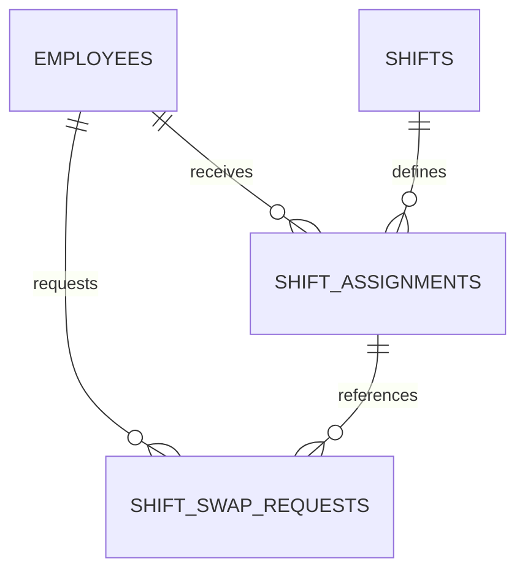

# ข้อ 5: Database Modeling for Shifts

## โจทย์

ออกแบบ Database Schema ที่รองรับการสลับกะ โดย:

- เก็บสถานะการอนุมัติจากหัวหน้า
- คำนวณเบี้ยเลี้ยงกะดึกได้ถูกต้องหลังมีการสลับกะ

## Database Schema

```sql
CREATE TABLE employees (
    id BIGINT PRIMARY KEY AUTO_INCREMENT,
    name VARCHAR(100) NOT NULL
);

CREATE TABLE shifts (
    id BIGINT PRIMARY KEY AUTO_INCREMENT,
    name VARCHAR(50) NOT NULL,
    start_time TIME NOT NULL,
    end_time TIME NOT NULL,
    night_allowance DECIMAL(10, 2) NOT NULL DEFAULT 0
);

CREATE TABLE shift_assignments (
    id BIGINT PRIMARY KEY AUTO_INCREMENT,
    employee_id BIGINT NOT NULL,
    shift_id BIGINT NOT NULL,
    work_date DATE NOT NULL,

    FOREIGN KEY (employee_id) REFERENCES employees(id),
    FOREIGN KEY (shift_id) REFERENCES shifts(id)
);

CREATE TABLE shift_swap_requests (
    id BIGINT PRIMARY KEY AUTO_INCREMENT,
    requester_employee_id BIGINT NOT NULL,
    target_employee_id BIGINT NOT NULL,
    requester_assignment_id BIGINT NOT NULL,
    target_assignment_id BIGINT NOT NULL,
    status ENUM('PENDING', 'APPROVED', 'REJECTED')
        NOT NULL DEFAULT 'PENDING',
    approved_by BIGINT NULL,
    approved_at DATETIME NULL,
    created_at DATETIME NOT NULL DEFAULT CURRENT_TIMESTAMP,

    FOREIGN KEY (requester_employee_id) REFERENCES employees(id),
    FOREIGN KEY (target_employee_id) REFERENCES employees(id),
    FOREIGN KEY (requester_assignment_id) REFERENCES shift_assignments(id),
    FOREIGN KEY (target_assignment_id) REFERENCES shift_assignments(id),
    FOREIGN KEY (approved_by) REFERENCES employees(id)
);
```

## ความสัมพันธ์



## ขั้นตอนการสลับกะ

1. พนักงานสร้างคำขอใน `shift_swap_requests` โดยสถานะเริ่มต้นเป็น `PENDING`
2. หัวหน้าตรวจสอบและเปลี่ยนสถานะเป็น `APPROVED` หรือ `REJECTED`
3. หากอนุมัติ ให้สลับ `employee_id` ระหว่าง Assignment ทั้งสองรายการภายใน Transaction เดียวกัน
4. บันทึกผู้อนุมัติและเวลาใน `approved_by` และ `approved_at`


## คำนวณเบี้ยเลี้ยงกะดึก

```sql
SELECT
    sa.employee_id,
    SUM(s.night_allowance) AS total_night_allowance
FROM shift_assignments sa
JOIN shifts s
    ON s.id = sa.shift_id
WHERE sa.work_date BETWEEN '2026-03-01' AND '2026-03-31'
GROUP BY sa.employee_id;
```

